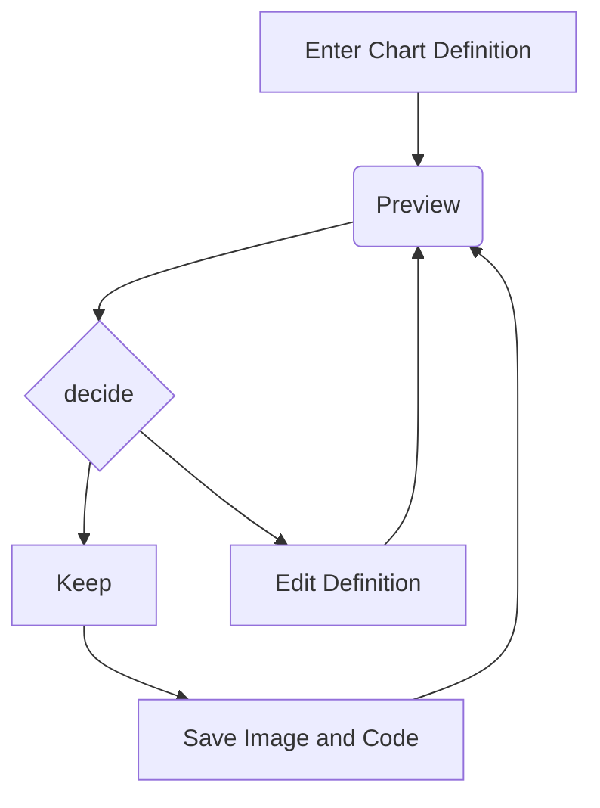
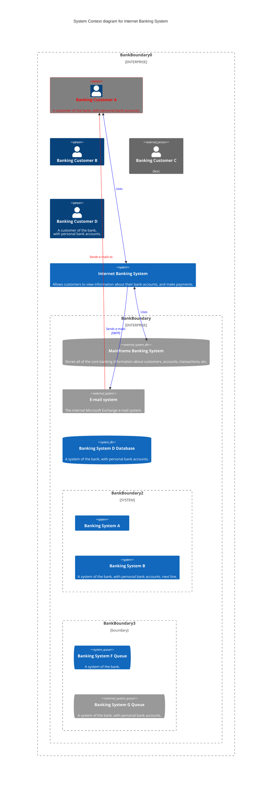

# How to use xxx

# Cat videos

::youtube[Video of a cat in a box]{#PeLgFCbVRXM}

:::{note}
if you chose xxx, you should also use yyy somewhere…
:::

# Head

Lift($$L$$) can be determined by Lift Coefficient ($$C_L$$) like the following
equation.

```math
L = \frac{1}{2} \rho v^2 S C_L
```
## heading

```js {1,3-4} showLineNumbers
function fancyAlert(arg) {
  if (arg) {
    $.facebox({ div: '#foo' })
  }
}
```


:::main{#readme}

Lorem:br
ipsum.

::hr{.red}

A :i[lovely] language know as :abbr[HTML]{title="HyperText Markup Language"}.

:::


:::note{.warning}
if you chose xxx, you should also use yyy somewhere…
:::

```python
print('this is python')
```

```{important}
Here is a note!
```

```{tip}
tip someple
```

````{important}
```{note}
Here's my `important`, highly nested note! 🪆
```
````

```{list-table} This is a nice table!
:header-rows: 1
:name: example-table

* - Training
  - Validation
* - 0
  - 5
* - 13720
  - 2744
```

| foo | bar |
| --- | --- |
| baz | bim |

~~Hi~~ Hello, ~there~ world!

- [x] foo
  - [ ] bar
  - [x] ba
- [ ] bim

Visit www.commonmark.org/help for more information.

Joy :joy:

```js
const a = () => {
  return 2;
};
```

Apple
: Pomaceous fruit of plants of the genus Malus in
the family Rosaceae.

Orange
: The fruit of an evergreen tree of the genus Citrus.

That's some text with a footnote.[^1]

# Vulputate ut pharetra sit amet.

Lorem ipsum dolor sit amet, consectetur adipiscing elit, sed do eiusmod tempor incididunt ut labore et dolore magna aliqua. Phasellus vestibulum lorem sed risus ultricies. Adipiscing vitae proin sagittis nisl rhoncus mattis rhoncus urna. Purus in massa tempor nec feugiat nisl pretium.

Enim lobortis scelerisque fermentum dui faucibus. Commodo viverra maecenas accumsan lacus. Ac ut consequat semper viverra nam libero justo laoreet sit. Magna etiam tempor orci eu lobortis elementum. Eget sit amet tellus cras adipiscing enim. **Sagittis nisl rhoncus mattis rhoncus urna neque viverra justo nec**.

## Quis varius quam quisque id diam vel.

Sit amet nisl suscipit adipiscing bibendum est ultricies integer quis. Faucibus scelerisque eleifend donec pretium vulputate sapien nec sagittis aliquam. Ac turpis egestas maecenas pharetra convallis. Interdum velit laoreet id donec ultrices tincidunt arcu. Et magnis dis parturient montes nascetur ridiculus mus mauris. Lectus mauris ultrices eros in cursus.

> Orci a scelerisque purus semper eget duis.

Ac auctor augue mauris augue neque gravida in fermentum et. Et pharetra pharetra massa massa ultricies mi quis hendrerit. Vulputate dignissim suspendisse in est ante in nibh mauris. Varius sit amet mattis vulputate enim nulla. **Feugiat nisl pretium fusce id velit ut tortor pretium.** Non tellus orci ac auctor augue mauris. Bibendum neque egestas congue quisque egestas diam in arcu cursus.

### Duis at consectetur lorem donec massa sapien faucibus et.

A diam maecenas sed enim. Feugiat pretium nibh ipsum consequat. Tellus rutrum tellus pellentesque eu tincidunt tortor aliquam. Massa id neque aliquam vestibulum morbi blandit cursus risus. Est ultricies integer quis auctor elit sed vulputate mi sit. Adipiscing bibendum est ultricies integer.

1. At tellus at urna condimentum mattis pellentesque id nibh tortor.
2. Eget dolor morbi non arcu risus quis varius quam quisque.
3. Nibh tellus molestie nunc non.
4. Sed faucibus turpis in eu mi bibendum neque.
5. Posuere sollicitudin aliquam ultrices sagittis orci a scelerisque.

[^1]: And that's the footnote.


# Hello

```js
const a = "test";
```

{{ title }}


table render

| Item         | Price | # In stock |
| ------------ | :---: | ---------: |
| Juicy Apples | 1.99  |        739 |
| Bananas      | 1.89  |          6 |




